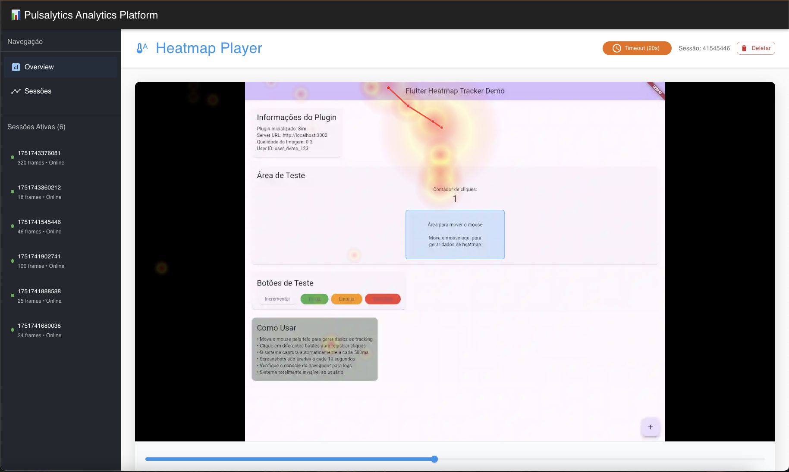

# Flutter Heatmap Tracker

> ⚠️ **Warning:** This project is still under development. Sensitive data handling and code optimization are not yet implemented. Use for testing and development only!

> **Attention:** To use all features of this library, you must:
>
> 1. Run the admin panel (admin-ui):
>    - Go to the `admin-ui` folder and run `npm install` then `npm start`.
>    - The panel allows you to view sessions, heatmaps, and monitor users in real time.
> 2. Run the WebSocket server:
>    - Go to the `heatmap-server` folder and run `npm install` then `npm run websocket`.
>    - This server receives real-time data from the Flutter plugin and makes it available to the admin-ui.
>
> Both must be running for real-time monitoring and visualization.

## Purpose

This library aims to track user interactions in Flutter Web applications, generating heatmaps, capturing clicks, mouse movements, and screenshots, and sending this data to a backend server. The goal is to provide detailed insights into user behavior, making it easier to analyze usability and identify points of interest or interface issues.

## How does it work?

- The plugin collects user interaction data (mouse, clicks, screenshots) and sends it to the server via HTTP and WebSocket.
- The server stores and processes this data.
- The admin-ui allows you to view active sessions, heatmaps, and real-time statistics.



## Features

- 🎯 **Mouse movement tracking** - Captures cursor positions in real time
- 🖱️ **Click detection** - Records all user clicks on the interface
- 📸 **Automatic screenshots** - Generates screenshots with heatmap overlay
- 🌐 **Multiple URL support** - Tracks different pages of the application
- 📤 **Automatic upload** - Sends data to the configured server
- 👤 **User identification** - Optional user ID support
- ⚡ **Optimized performance** - Invisible and high-performance system
- 🎨 **Real-time visualization** - Optional visual overlay for debugging

## Installation

Add the dependency to your `pubspec.yaml`:

```yaml
dependencies:
  flutter_pulsalytics: ^1.0.0
```

Run:

```bash
flutter pub get
```

## Basic Usage

### 1. Simple Initialization

```dart
import 'package:flutter_pulsalytics/flutter_pulsalytics.dart';

void main() async {
  WidgetsFlutterBinding.ensureInitialized();
  
  // Initialize the plugin
  PulsalyticsPlugin.initialize(
    serverUrl: 'https://your-server.com/api',
  );
  
  runApp(MyApp());
}
```

### 2. Full Configuration

```dart
PulsalyticsPlugin.initialize(
  serverUrl: 'https://your-server.com/api',    // Required
  imageQuality: 0.8,                           // Optional (0.0 - 1.0)
  userId: 'user_123',                          // Optional
);
```

### 3. Status Check

```dart
// Check if initialized
bool isReady = PulsalyticsPlugin.isInitialized;

// Access settings
String? serverUrl = PulsalyticsPlugin.serverUrl;
double? quality = PulsalyticsPlugin.imageQuality;
String? userId = PulsalyticsPlugin.userId;
```

## Server Configuration

The plugin sends data to two endpoints:

### Image Upload
```
POST /upload
Content-Type: multipart/form-data

Fields:
- image: image file (WebP or JPEG)
- userId: user ID (if configured)
```

### Session Events
```
POST /session-event
Content-Type: application/x-www-form-urlencoded

Fields:
- sessionId: session ID
- eventType: 'session_end'
- timestamp: event timestamp
- userId: user ID (if configured)
```

## Node.js Server Example

```javascript
const express = require('express');
const multer = require('multer');
const cors = require('cors');
const app = express();

app.use(cors());
app.use(express.urlencoded({ extended: true }));

const upload = multer({ dest: 'uploads/' });

// Image upload
app.post('/upload', upload.single('image'), (req, res) => {
  console.log('Image received:', req.file.filename);
  console.log('User ID:', req.body.userId);
  res.json({ success: true });
});

// Session events
app.post('/session-event', (req, res) => {
  console.log('Event:', req.body);
  res.json({ success: true });
});

app.listen(3001, () => {
  console.log('Server running on port 3001');
});
```

## How it works

### Automatic Capture
- **Fast Capture**: Every 500ms when the mouse is moving
- **Full Screenshot**: Every 10 seconds
- **URL Change Detection**: Automatic for SPAs

### Data Captured
- Mouse positions (x, y, timestamp)
- User clicks (x, y, timestamp)
- Current page URL
- Unique session ID per user
- Session metadata

### Image Format
- **Format**: WebP (with JPEG fallback)
- **Resolution**: Maximum 1920x1080
- **Quality**: Configurable (default: 0.2)
- **Overlay**: Heatmap + mouse trail + clicks

## Advanced Settings

### Image Quality
```dart
// Low quality, smaller size (recommended for production)
imageQuality: 0.2

// High quality, larger size (recommended for debugging)
imageQuality: 0.8
```

### User Identification
```dart
// No identification
userId: null

// With custom ID
userId: 'user_${DateTime.now().millisecondsSinceEpoch}'

// With authentication system ID
userId: currentUser.id
```

## Debugging and Monitoring

### Browser Console
The plugin generates detailed logs in the console:

```javascript
// Check heatmap data
showHeatmapData()

// Session information
getSessionInfo()

// Reset session (development)
resetSession()
```

### Available Debug Functions
- `window.showHeatmapData()` - Shows collected data
- `window.getSessionInfo()` - Current session information
- `window.resetSession()` - Reset session (requires reload)

## Performance Considerations

### Implemented Optimizations
- Automatic image compression
- Throttling of captures by movement
- Automatic cleanup of old data
- System completely invisible to the user

### Recommendations
- Use low image quality (0.2-0.4) in production
- Set up the server with good storage capacity
- Monitor upload sizes
- Implement log rotation on the server

## Compatibility

- ✅ **Flutter Web**: Full support
- ❌ **Flutter Mobile**: Not supported (web only)
- ✅ **Browsers**: Chrome, Firefox, Safari, Edge

## Requirements

- Flutter >= 2.0.0
- Dart >= 2.12.0
- Browser with html2canvas support
- Server to receive uploads

## Complete Example

See the complete example in the `/example` folder of the plugin.

## Contribution

Contributions are welcome! Please:

1. Fork the project
2. Create a branch for your feature
3. Commit your changes
4. Open a Pull Request

## License

This project is licensed under the MIT license. See the LICENSE file for details.

## Support

For questions and issues:
- Open an issue on GitHub
- Check the example documentation
- Check the browser console logs
